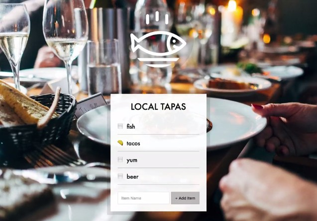

## JavaScript30 Day 15 - LocalStorage

In this tutorial, we learn to use local storage to help persist our data. We build a Local Tapas item list that allows user to add new items, toggle checked item in the list to be included. The checklist will have same state of the checked items in the list even after browser has been refreshed.

[View demo site here.](https://webdevtuts.github.io/javascript30_15/)

